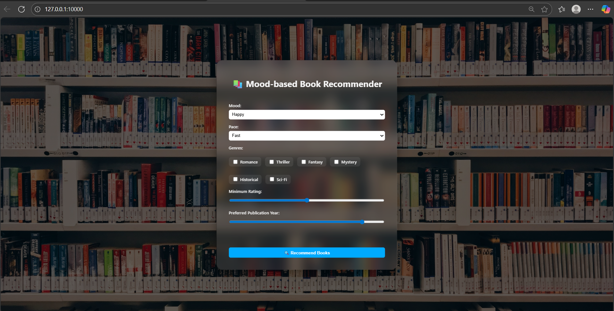
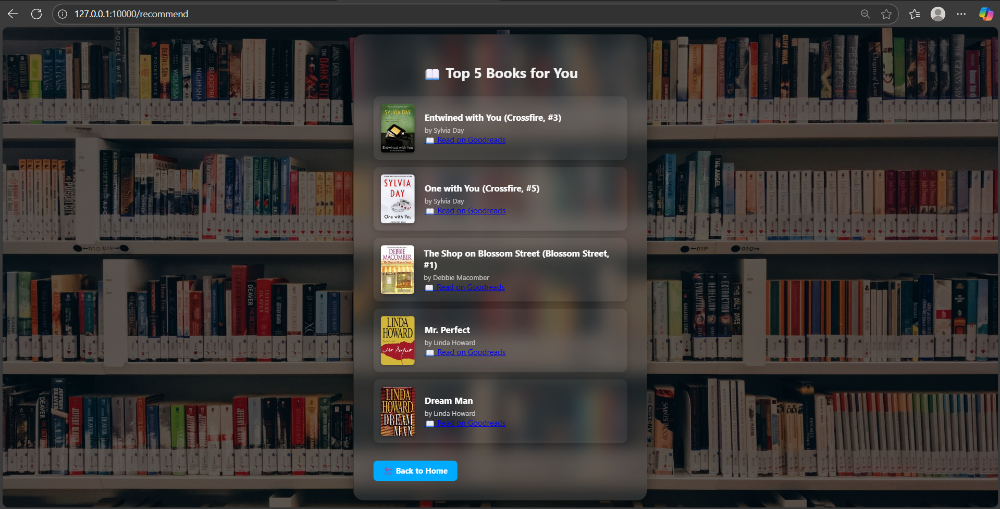

# 📚 Mood-Based Book Recommender

An intelligent **content-based book recommendation system** that suggests books based on your mood.  
Built using **Flask**, **Python**, and **Machine Learning (KNN + TF-IDF)**, this web app delivers personalized book recommendations with a beautiful, responsive UI.

🔗 **Live Demo:** [https://book-recommender-zgjt.onrender.com](https://book-recommender-zgjt.onrender.com)  
📂 **Repository:** [GitHub Repo](https://github.com/vushagonirohith/book-recommender)

---

## ✨ Features

- ✅ **Mood-based Recommendations** — Choose a mood, get curated book suggestions.
- ✅ **Machine Learning Model** — KNN with TF-IDF for content-based filtering.
- ✅ **Beautiful UI** — Glassmorphism design with responsive layout.
- ✅ **Interactive Book Cards** — Click to enlarge images & view more details.
- ✅ **Easily Extensible** — Add more moods, books, or integrate authentication.

---

## 🧠 How it Works

1. **User selects a mood** (e.g., Happy, Sad, Romantic).
2. **Mood maps to tags** (e.g., "romantic" → "romance").
3. **TF-IDF Vectorizer** converts tags into vectors.
4. **KNN Model** finds nearest books by cosine similarity.
5. **Recommendations displayed** with title, image, and optional purchase link.

---

## 📸 Screenshots

> Replace these placeholders with your actual screenshots.  
> Save them inside `static/images/screenshots/` and update the paths.

| Home Page | Recommendations |
|-----------|
|  |  |

---

## 🚀 Tech Stack

**Frontend:**
- HTML, CSS, JavaScript

**Backend:**
- Python, Flask

**Machine Learning:**
- scikit-learn (TF-IDF, KNN)
- pickle (model persistence)

**Deployment:**
- GitHub
- Render

---

## 📂 Project Structure

book_recommender/
│
├── app.py # Flask backend logic
├── requirements.txt # Python dependencies
├── books_with_tags.pkl # Book metadata with tags
├── knn_model.pkl # Pre-trained KNN model
├── tfidf_vectorizer.pkl # TF-IDF vectorizer
├── scaler.pkl # Optional scaler
│
├── static/
│ ├── style.css # CSS styling
│ ├── images/
│ │ ├── background.jpg
│ │ └── screenshots/ # Store screenshots here
│
├── templates/
│ ├── index.html # Mood selection page
│ └── results.html # Results page
│
└── README.md


---

## ⚙️ Installation & Setup

1. **Clone the repository**
   ```bash
   git clone https://github.com/vushagonirohith/book-recommender.git
   cd book-recommender

🧪 Example Usage
Select your mood (e.g., Happy).

Click Get Recommendations.

View recommended books with cover images and descriptions.
